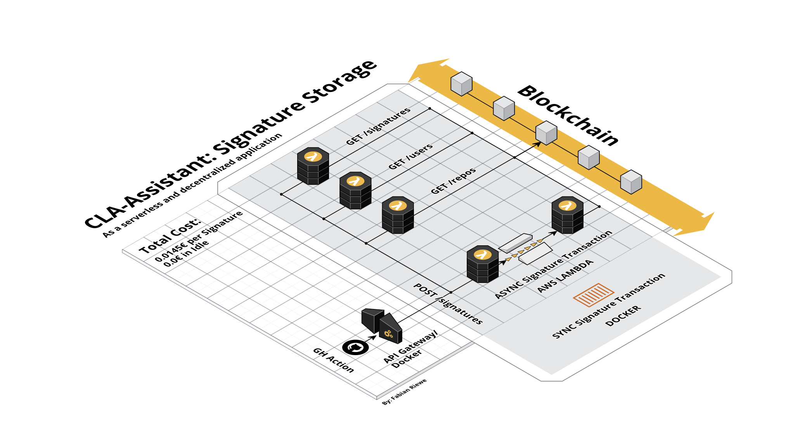

# Usage

## Prerequisites

- AWS Account (when run in serverless mode)
- Ethereum Wallet (when deployed on ethereum-blockchain) with some Ether for the [gas fee / transaction fee](https://ethereum.stackexchange.com/questions/3/what-is-meant-by-the-term-gas)
- Blockchain Access (ganache, infura, truffle develop, etc.)

## Smart Contract

The documentation of the smart contract can be found [here](./docs/index.md).
Use `npm run soldity-docgen` to regenerate the docs.

## Setup

1. Create a `.env`-File
2. Add the following variables:

- `MNEMONIC` (_required_): Your crypto-wallett mnemonic or private key
- `ENDPOINT` (_required_): Your blockchain endpoint
- `SQS_QUEUE_URL` (_optional_): The URL of the AWS SQS Queue (only when in serverless)

## Local development

1. In the `.env`-File set the `ENDPOINT` to `http://127.0.0.1:9545/`
2. Run the following command:
   - `truffle develop`
   - `> migrate`
   - _Open new terminal_
   - `npm serve`
   - _Open new terminal_
   - `cd client`
   - `npm serve`

## Endpoints

- GET /health -> used for healthcheks, always returns 200.
- GET /status -> the contract can be paused. Can be checked via this endpoint.
- GET /signatures -> use `signature_id` as query parameter to get a single signature
- POST /signatures -> endpoint for GitHub-Action to connect to
- GET /users -> use `user_id` as query parameter to get all signatures by a GitHub user
- GET /repos -> use `repo_id` as query parameter to get all signatures by a GitHub repository

## Architecture

